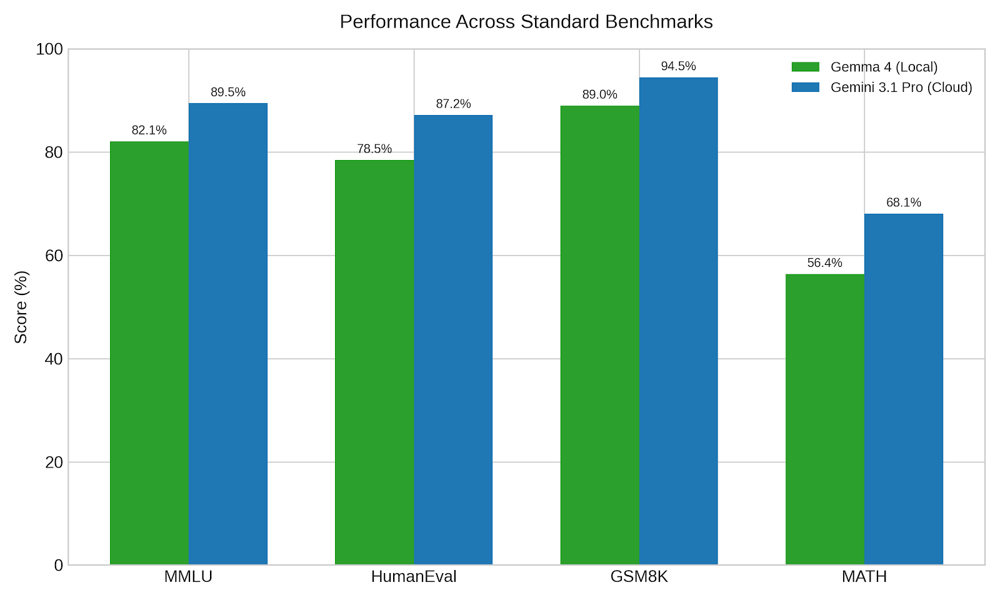
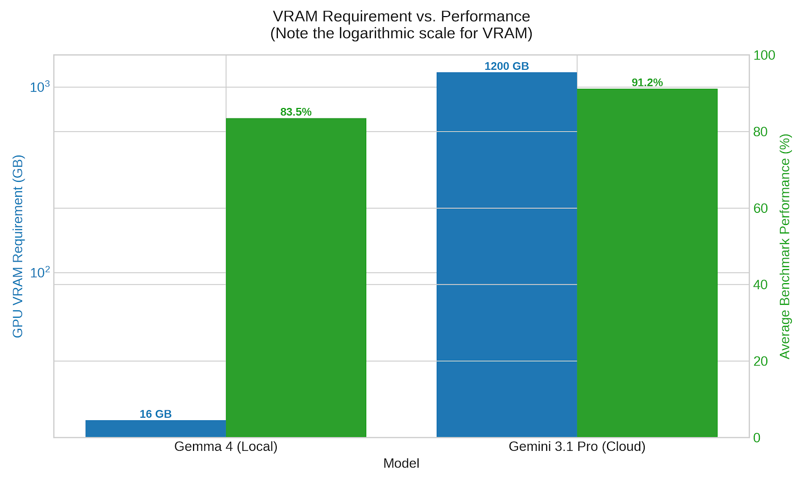

Even if you're not an AI enthusiast, someone who enjoys self-hosting, or a privacy advocate, local LLMs are having a moment. Let me explain what it means to run AI models locally and why you might want to.

## Why would I want to run AI models locally?
The place for computation has changed throughout time. Early computers were mainframes, with terminals that could access them. PCs brought much of the computing to a user's device. The web then enabled software to run on a machine that isn't the user's.

Some people talk about how this way of doing inference computing with frontier models is flipped, since computation has traditionally all happened locally. But, obviously, that isn't true. What _is_ true is that since the era of the personal computer, there has been a _choice_ between doing things locally or on a server somewhere. We still have that choice, but it comes with some caveats. But let's talk about why we might want to.
### Privacy
One of the primary reasons people don't like using cloud or web-based services is that they have to send their data somewhere else, and who knows what happens to it after that. This doesn't need to be an article about all of the abuses of customer data, but let it suffice to say that companies have not always been the best stewards of customer privacy. Running a model on your own device means you get complete privacy, and the data never leaves your machine. 
### Freedom
When using a model a service hosts, you are obligated to abide by that service's terms and conditions. Like placing limits on when and how much you can use it. Or they can put guardrails on, censor the model's outputs, or make the model behave in a way you don't want. And what happens when the service deprecates the model that you're using? If you have spent a lot of time tuning your system to work with a specific model just to have it deprecated, you'll have to move to a newer model. And if that newer model behaves differently or costs more, that could lead to a lot of frustration.
### Offline
We now live in a world that is so connected. You can be online almost anywhere. So this one might not seem like a big deal, but for me, I've run into several situations where I didn't have access to the Internet. Like doing some coding on an airplane with no WiFi, or sitting at the beach or in a cabin with no mobile data hotspot. Having access to the vast knowledge within a large language model has allowed me to continue working without missing access to the Internet. Also, I'm not much of a doomsday prepper, but I like knowing that if anything _were_ to happen to my Internet access, I still have an incredibly powerful model on a USB drive.
### Costs
Running your own model doesn't mean it's free. You still had to buy a device that could run the model. But once you have it, you're not paying for each request or the number of tokens to a service provider. You're operating at electricity costs at that point. Depending on the type of hardware you buy, it will take heavy use to recoup the cost of your device. Unless you plan to use it often, this reason may not be a selling point for you. But assuming you _do_ value AI and plan to use it a lot, this could be a good long-term investment for you. 

## Why not always local?
If any of the reasons I just explained seem compelling to you, you might wonder why you would ever _not_ want to use models locally.

While the answer is simple: **hardware constraints**, the explanation can be detailed.

Language models require a massive amount of memory and GPU capacity. Running SOTA (state-of-the-art) models requires massive scale. To put things in perspective, the DeepSeek R1 model, which was state-of-the-art in early 2025, requires 16 NVIDIA H100 GPUs, each with 80GB of RAM, to run at full precision and at enterprise scale. In early 2025, a single H100 card retailed somewhere between $25,000 and $40,000, depending on configuration and volume discounts. And DeepSeek R1 was notable for being more efficient to run than its competition.

Since then, models and GPUs have just gotten larger and more expensive. If you've been paying even a little attention to the big multi-billion-dollar deals between these AI labs and hyperscalers, this starts to make more sense given how compute-intensive these workloads are. 

In short, you just can't run these large models on any consumer hardware you have access to. 

## How good are local models, then?
Did I just convince you that you want local models, only to let you down by saying you can't? 

While the types of models we can run on consumer hardware nowhere near match the performance of SOTA models, the performance scale does not decrease linearly. One of the great things about large language models is that you can distill the knowledge from a larger, more powerful model into a smaller model, as you can see from the charts below.

The other thing is that for most things, you don't need the full power of these massive models. Being able to answer simple questions or provide a little coding assistance is all you need.

Some of the most recent model releases that you can run on your own device are exceptional. Google's Gemma 4 and Alibaba's Qwen 3.6 are both efficient and very powerful. My opinion is that these models still aren't at a level where you can do all your coding with them, but they're powerful enough to handle some of it.

## My use cases
So, how am I using local models? My use cases are somewhat personal to me and may not fit your needs, but I'll share how I use them to see if that sparks any ideas for you. 
### Dictation
I have used dictation apps for several years now, but one problem is that speech is not very clean and contains filler words that you do not want in your writing. Much of this article, for example, has been dictated. This workflow is that my raw dictation is fed into an LLM to clean up my uh-s and um-s. And then I go back after it's done and clean up any remaining issues. Cleaning up text can be done with a very small model. The model I currently use for this is: Nemotron 3 Nano 4B.
### Summarization
I don't know about you, but I have so much content in my backlog that there's no way I can consume it all. So I have to be very careful about what I read, listen to, or watch because I only want to spend my time on the best content. 

I have set up a number of workflows that summarize things like my list of articles, the podcast I am going to listen to, or the YouTube videos in my playlist. My local model summarizes all of these and lets me decide whether to consume the content or skip it. 

Some people say you can use a pretty weak model for summarization, but I have found that a more powerful model has the context, awareness, and world knowledge that makes a difference in the summary. So, for this, I have been switching between Gemma 4 26B or Qwen 3.6 35B.

### Knowledge lookup
Local models also serve as my "personal Stack Overflow." Whenever I'm working on something technical, and I forget how to do something or don't know a command or CLI function, I turn to my local model to ask the question. Things like looking up how to do that one tmux command I rarely use, or the proper syntax for a TypeScript guard.

### Coding
And as I mentioned previously, I've started using these for basic coding tasks. I still value the intelligence of state-of-the-art models for orchestration and planning, but once a sound plan is done, and the task is sufficiently defined, these local models do a pretty good job of banging out the code.

For me, I haven't abandoned using models in the cloud. I'm supplementing that use with local workloads. I value having access to models offline and the personal choice of which models I use and for how long. If you're interested, download a tool like [LM Studio](https://lmstudio.ai/download). Get a model that fits on your device and try it out. 